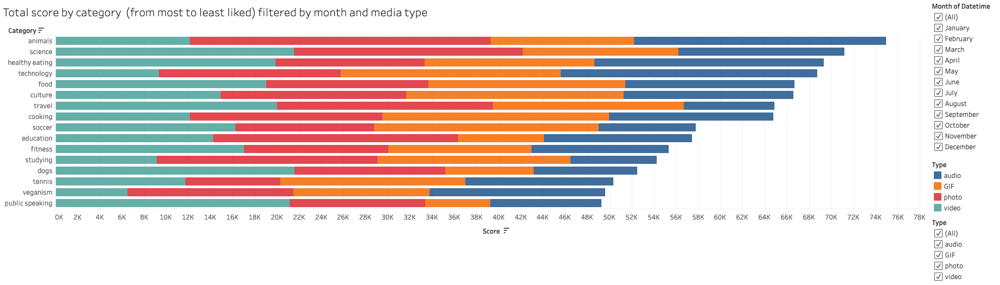

```{r setup, include=FALSE}
library(tidyverse)
library(lubridate)
```

###  Social Buzz Content Analysis

The client (Social Buzz) wanted to see "an __analysis__ of their __content categories__ showing the __top 5__ categories with the largest popularity."
  
* According to the data model, popularirty is quantified by the _Score_ given to each reaction type.  
* Therefore, I need data showing the content ID, category, content type, reaction type, and reaction score.  
* So, to figure out popularity, I will have to add up which content categories have the largest score.  

***

__[Interactive version of the dashboard](https://public.tableau.com/views/SocialBuzz_16744411206820/Totalscorebycategory-Barchart?:language=en-US&:display_count=n&:origin=viz_share_link)__   

***
#### Data loading, transformation, and modeling

Removing rows that have __missing values__, __transforming values__ within a column, and __removing columns which are not relevant__ to this task.  

Then merge data tables to __create a cleaned dataset__. 

```{r, LoadAndTransform}
# load csv files and select columns
reaction_types <- read.csv('ReactionTypes.csv') %>% 
  select(-X) %>% 
  rename(Reaction_Type = Type) 
reactions <- read.csv('Reactions.csv') %>% 
  select(-X) %>% 
  rename(Reaction_Type = Type)
content <- read.csv('Content.csv') %>% 
  select(-X, -User.ID, -URL)

# merge datasets and drop nulls
merged_df <- left_join(reactions, reaction_types, by = "Reaction_Type") %>% 
  left_join(content, merged_df, by = "Content.ID") %>% 
  drop_na()

# remove punctuation marks and change text to lowercase
merged_df$Category <- gsub("[[:punct:]]", "", merged_df$Category)
merged_df$Category <- tolower(merged_df$Category) 
```

Verify there are no duplicates in the _Category_ column anymore. 
```{r, FindUniqueCategories}
# find number of unique categories
merged_df %>% distinct(Category)
```
***

#### Exploratory analysis
  
A pipe workflow for the final data set to group by category, count the number of corresponding posts, and return top 5 most active categories. 
  
```{r, TotalPostsByCategory}
total_posts_by_category <- merged_df %>%
  group_by(Category) %>%
  summarize(count = n()) %>%
  arrange(desc(count)) %>% 
  head(5)

total_posts_by_category
```

A pipe workflow for the final data set to group by category, summarize the corresponding reaction score, and return top 5 most liked categories.  

```{r, TotalScoreByCategory}
total_score_by_category <- merged_df %>%
  group_by(Category) %>%
  summarize(sum_score = sum(Score)) %>%
  arrange(desc(sum_score)) %>% 
  head(5)

total_score_by_category
```

A pipe workflow for the final data set to group by month, count the number of corresponding posts, and return the most active month. 

```{r, BestMonth}
# find month with highest number of posts
best_month <- merged_df %>% 
  mutate(month = month(Datetime)) %>% 
  mutate(month_name = month.name[month]) %>% 
  group_by(month_name) %>% 
  summarize(count = n()) %>% 
  arrange(desc(count)) %>% 
  head(5)

best_month
```
